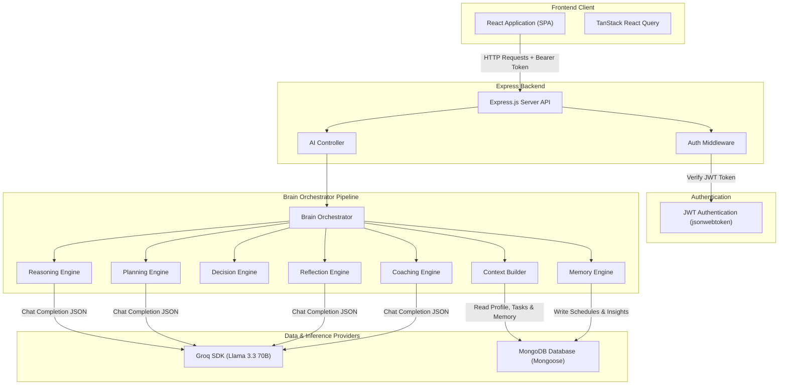
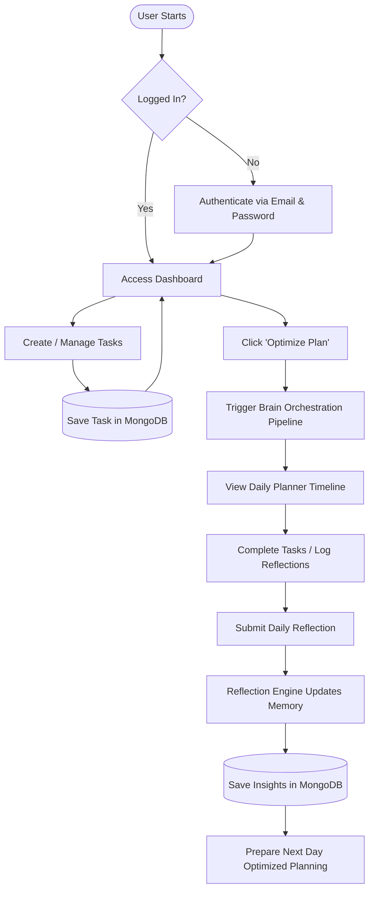
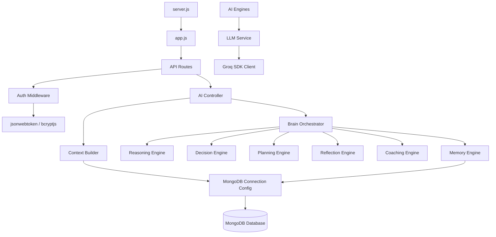
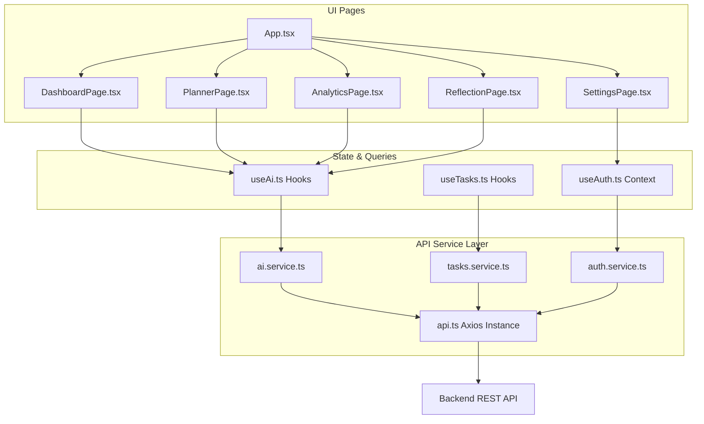
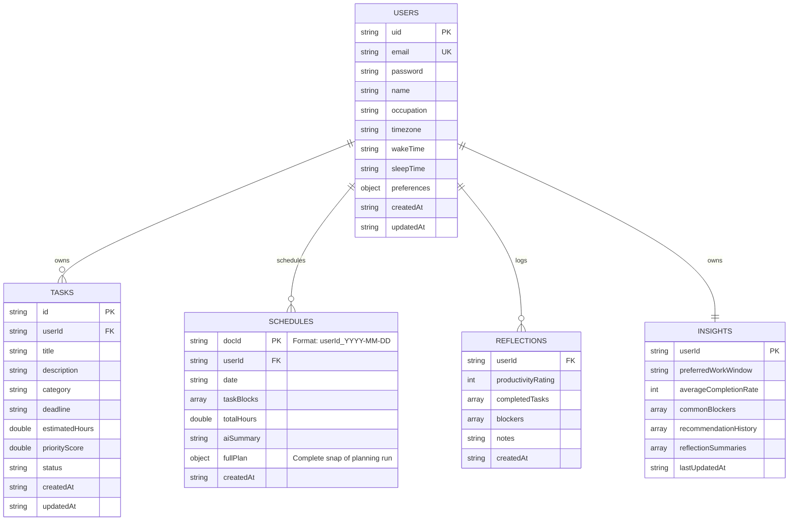
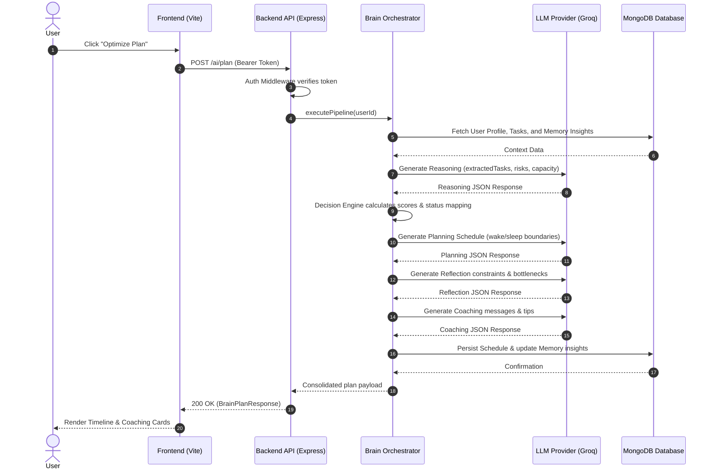

# Momentum AI — MongoDB + Groq Edition

### AI-powered Personal Productivity & Adaptive Planning Assistant

Momentum AI is a state-of-the-art cognitive productivity platform that transforms task management from a passive storage database into a proactive planning pipeline. By dynamically evaluating deadlines, relative task dependencies, and daily work/sleep hour boundaries, the platform programmatically maps daily tasks into optimized focus time blocks, identifies behavioral bottlenecks, and generates contextual coaching advice.

[](https://react.dev/)
[](https://www.typescriptlang.org/)
[](https://nodejs.org/)
[](https://expressjs.com/)
[](https://www.mongodb.com/)
[](https://jwt.io/)
[](https://groq.com/)
[](https://tailwindcss.com/)
[](https://vite.dev/)

> [!NOTE]
> **Infrastructure Migration Notice:** This branch (`migration/mongodb-groq`) is an infrastructure migration of the original Momentum AI hackathon project. Firebase has been fully replaced with MongoDB Atlas + local JWT authentication, and Gemini has been replaced with Groq API completions. The core application logic, frontend UI, routes, and overall cognitive engines remain completely identical to the original hackathon implementation.

---

## Project Assets
- **[🎥 Demo Video Placeholder]**
- **[📊 Presentation Deck Placeholder]**
- **[🌐 Live Demo Platform Placeholder]**

---

## 🔄 Infrastructure Migration

This version of Momentum AI replaces proprietary and managed services with open, developer-controlled, and self-hosted infrastructure. 

| Original Stack Component | Migrated Stack Component |
| :--- | :--- |
| **Firebase Authentication** | **JWT Authentication + bcrypt** |
| **Cloud Firestore** | **MongoDB Atlas + Mongoose** |
| **Firebase Admin SDK** | **Mongoose ODM** |
| **Google Gemini API** | **Groq SDK (Llama 3.3 70B)** |
| **Firebase Hosting** | **Deployment Agnostic (Render, Railway, local)** |

### Why This Migration?
1. **Zero Vendor Lock-In**: Complete independence from proprietary platforms like Firebase.
2. **Localhost Agnostic**: Run and test the entire stack entirely on local offline environments without cloud quota limits.
3. **Open-Source Infrastructure**: Move to standard databases (MongoDB) and standard sessions (JWT) used in self-hosted deployments.
4. **Fast Inference**: Harness Groq Cloud's ultra-low latency Llama-3.3-70b inference for lightning-fast planning JSON pipelines.

---

## 1. Problem Statement

### Why Productivity Apps Fail
Traditional task managers (to-do lists, calendars, and kanban boards) are passive record-keeping tools. They rely entirely on the user to schedule their day, organize task sequences, and estimate durations. When things go wrong, the user must manually re-plan everything, resulting in high cognitive friction, decision fatigue, and eventual planner abandonment.

### Why Static Planners Fail
1. **Zero Adaptation**: They cannot adapt dynamically to real-world interruptions, delayed work, or new urgent tasks.
2. **Cognitive Overhead**: The scheduling process itself takes valuable time away from execution.
3. **No Closed-Loop Learning**: Conventional apps do not track why a task was skipped, when you are most productive, or what blockers continuously stall your work.

### The Momentum AI Approach
Momentum AI resolves these issues by handling the prioritization and scheduling logic programmatically. When workload disruptions or missed tasks are detected, the system triggers **Adaptive Replanning** to re-optimize schedules instantly, keeping you in your productivity flow.

---

## 2. The Solution

Momentum AI utilizes a multi-engine **Cognitive Planning Pipeline** that evaluates user tasks, preferences, and performance history to deliver an optimized, distraction-free work schedule.

```text
  [Context Builder] ──► [Reasoning] ──► [Decision] ──► [Planning] ──► [Reflection] ──► [Coaching] ──► [Memory]
```

- **Reasoning Engine**: Performs semantic checking of task requirements and constraints.
- **Decision Engine**: Prioritizes tasks (1-100 score) using deadline urgency and dependency trees.
- **Planning Engine**: Organizes tasks into structured time blocks within your sleep/wake constraints.
- **Reflection Engine**: Reviews task outcomes, identifies productivity blockers, and maps trends.
- **Coaching Engine**: Renders contextual, positive, and action-oriented daily advice cards.
- **Memory Engine**: Persists schedule snapshots and observation insights in Cloud Firestore to continuously personalize future recommendations.

---

## 3. Key Features

### 📅 AI Planner Timeline
Automatically creates a chronological, color-coded sequence of task blocks fitting your waking hours. Includes a clean view of estimated task durations and custom recommendations.

### 🔄 Adaptive Replanning Triggers
Monitors plan consistency. If an urgent task is added, a deadline is moved, or a task block is missed, the UI alerts the user and lets them regenerate their plan instantly with one click.

### 📊 Productivity Analytics
Visualizes your performance with responsive metrics:
- Overall Task Completion Rate (%).
- Overdue Task Count.
- Peak Productivity Work Windows (computed from historical memory).
- Weekly Task Completion Trends (Interactive Bar Chart).

### 📝 End-of-Day Reflections
Let's you check off completed tasks, rate your focus level, catalog productivity blockers (e.g., social media, fatigue, technical issues), and save qualitative insights directly to your memory profile.

### ⚙️ Customizable Settings
Configure your profile name, email, morning wake-up hours, and evening sleep times to set strict boundaries for AI planning blocks.

---

## 4. System Architecture

The following diagram illustrates the relationship between the React Frontend, authentication middleware, Express API controllers, the internal Brain Orchestrator pipeline, and database/LLM providers (MongoDB & Groq):



---

## 5. User Journey Flowchart

Here is the operational path a user takes from signup/login through planning execution and reflective feedback loops:



---

## 6. Brain Pipeline Architecture

The sequential engines run in strict order. Data validation and JSON schemas check the output of each engine, halting execution if errors occur:

```mermaid
graph LR
    subgraph Input
        CB[Context Builder]
    end
    subgraph Evaluation
        RE[Reasoning Engine]
        DE[Decision Engine]
    end
    subgraph Generation
        PE[Planning Engine]
    end
    subgraph Optimization
        RFE[Reflection Engine]
        CE[Coaching Engine]
    end
    subgraph Feedback Loop
        ME[Memory Engine]
    end

    CB -->|Build context| RE
    RE -->|Workload evaluation| DE
    DE -->|Task priority & status scoring| PE
    PE -->|Optimized time blocks schedule| RFE
    RFE -->|Feasibility checks & observations| CE
    CE -->|Encouraging daily coaching messages| ME
    ME -->|Persist schedules & learning trends| MongoDB[(MongoDB Database)]
```



- **Context Builder**: Normalizes tasks, profile, and memory into a single structured schema.
- **Reasoning**: Analyzes task complexity and potential scheduling conflicts.
- **Decision**: Programmatically calculates priority ratings and handles task dependencies.
- **Planning**: Generates start/end times for daily task blocks.
- **Reflection**: Identifies performance leaks, skipped tasks, and blockers.
- **Coaching**: Produces encouraging, positive daily focus guidelines.
- **Memory**: Merges metrics and saves schedule histories.

---

## 7. Backend Module Dependency Diagram

The architectural diagram below highlights the structural hierarchy of backend layers and configs:



---

## 8. Frontend Component Architecture

The visual below maps page layers, data-fetching hooks, API service wrappers, and Axios clients:



---

## 9. Database Entity-Relationship Diagram

Momentum AI is powered by MongoDB Atlas document collections configured via Mongoose schemas:



---

## 10. API Specification

| Method | Endpoint | Purpose | Authentication |
| :--- | :--- | :--- | :--- |
| **POST** | `/auth/register` | Registers a new user credentials document in MongoDB. | No |
| **POST** | `/auth/login` | Validates credentials and returns a signed JWT. | No |
| **GET** | `/auth/me` | Returns current authenticated user profile. | Yes (Bearer Token) |
| **GET** | `/auth/profile` | Compatibility route to return profile. | Yes (Bearer Token) |
| **PUT** | `/auth/profile` | Updates user settings (wake-up time, sleep time). | Yes (Bearer Token) |
| **GET** | `/tasks` | Retrieves all active and completed tasks for the authenticated user. | Yes (Bearer Token) |
| **POST** | `/tasks` | Creates a new task. | Yes (Bearer Token) |
| **PUT** | `/tasks/:id` | Modifies an existing task's attributes or status. | Yes (Bearer Token) |
| **DELETE**| `/tasks/:id` | Deletes a task. | Yes (Bearer Token) |
| **POST** | `/ai/plan` | Runs the planning pipeline and generates today's schedule. | Yes (Bearer Token) |
| **GET** | `/ai/plan/today` | Retrieves today's persisted schedule plan if one exists. | Yes (Bearer Token) |
| **POST** | `/ai/replan` | Runs the adaptive replanning flow. | Yes (Bearer Token) |
| **POST** | `/ai/reflection` | Submits daily reflection logs and updates memory. | Yes (Bearer Token) |
| **GET** | `/ai/insights` | Computes user-wide analytics metrics. | Yes (Bearer Token) |

---

## 11. AI Planning Request Lifecycle

The diagram below shows the sequence of events from clicking "Optimize Plan" to rendering the completed schedule:



---

## 12. Repository Structure

```text
Momentum-AI/
├── backend/
│   ├── src/
│   │   ├── brain/
│   │   │   ├── context/          # Context-builder logic
│   │   │   ├── modules/          # Core engines (Reasoning, Planning, etc.)
│   │   │   ├── prompts/          # String template files for Groq prompts
│   │   │   ├── schemas/          # Struct validators and default schema constructs
│   │   │   └── orchestrator/     # Pipeline orchestrator & step validation errors
│   │   ├── config/               # DB & Groq connection clients
│   │   ├── controllers/          # AI, authentication, and task route controllers
│   │   ├── middleware/           # JWT Auth Bearer Token validators
│   │   ├── models/               # Mongoose database collection schemas
│   │   ├── routes/               # API Router maps
│   │   ├── services/             # Analytics metrics & reflection observers services
│   │   └── app.js                # Express app framework initialization
│   ├── server.js                 # Local server execution port listener
│   └── package.json
├── docs/
│   └── assets/                   # Screenshots & images folder
├── frontend/
│   ├── src/
│   │   ├── components/           # Tasks, forms, timeline cards, charts
│   │   ├── constants/            # Routing path declarations
│   │   ├── contexts/             # Auth provider contexts (local JWT session)
│   │   ├── hooks/                # Custom React hooks (React Query integrations)
│   │   ├── layouts/              # Main structure with Sidebar
│   │   ├── pages/                # Pages (Planner, Analytics, Reflection, Settings)
│   │   ├── services/             # Axios request definitions (JWT injection)
│   │   ├── types/                # Typescript interfaces
│   │   ├── main.tsx              # Mounting index
│   │   └── index.css             # Main styling index
│   ├── vite.config.ts
│   └── package.json
└── README.md
```

---

## 13. Installation & Run Guide

### Prerequisites
1. [Node.js](https://nodejs.org/) (v18 or higher recommended).
2. [MongoDB](https://www.mongodb.com/) (either a local MongoDB instance running on port 27017, or a MongoDB Atlas cloud connection URI).
3. A [Groq API Key](https://console.groq.com/) (inference provider for the Llama-3.3-70b planning pipeline).

---

### Step 1: Backend Setup
1. Navigate to the backend directory:
   ```bash
   cd backend
   ```
2. Install dependencies:
   ```bash
   npm install
   ```
3. Create a `.env` file from the template:
   ```bash
   cp .env.example .env
   ```
4. Update the environment variables:
   ```env
   PORT=5000
   MONGODB_URI=mongodb://127.0.0.1:27017/momentum_ai
   JWT_SECRET=your_jwt_secret_key
   JWT_EXPIRE=7d
   GROQ_API_KEY=your-groq-api-key
   ```
5. Run the dev server:
   ```bash
   npm run dev
   ```
   The backend should log:
   ```text
   Groq SDK initialized successfully.
   Active LLM Provider: Groq
   Server is running on port 5000
   MongoDB connection initialized successfully.
   ```

---

### Step 2: Frontend Setup
1. Open a new terminal and navigate to the frontend directory:
   ```bash
   cd frontend
   ```
2. Install dependencies:
   ```bash
   npm install
   ```
3. Create a `.env` file inside the `frontend` root:
   ```bash
   touch .env
   ```
4. Configure the environment variables to point to the backend API:
   ```env
   VITE_API_URL=http://localhost:5000
   ```
5. Run the Vite development server:
   ```bash
   npm run dev
   ```
6. Open your browser and navigate to the URL provided by Vite (typically `http://localhost:5173`).

---

## 14. Screenshots

| Section | Visual |
| :--- | :--- |
| **Dashboard** |  |
| **AI Planner** |  |
| **Analytics** |  |
| **Daily Reflection** |  |
| **Settings** |  |

---

## 15. Performance & Reliability

### Authentication Security
Requests sent to backend AI, task, and analytics routes are verified by the `auth.middleware.js` using local JWT Bearer token authentication. If a token is missing, invalid, or expired, the backend returns a `401 Unauthorized` response.

### Plan Persistence
Schedules generated by the Brain Orchestrator are saved to the `schedules` collection in MongoDB with a unique document ID format (`${userId}_${todayDateStr}`). When the page is reloaded, the app retrieves the existing schedule, ensuring it survives page refreshes.

### Fault Tolerance & Fallback Schemas
If the Groq API fails or rate limits (`429`) occur during pipeline execution, the system uses fallback schemas (implemented in `backend/src/brain/schemas/`) for the planning, reasoning, reflection, and coaching stages. This prevents backend crashes, keeps validation rules intact, and returns a usable default schedule.

### Normalization
The `getTodayPlan` endpoint in the AI controller automatically normalizes documents before sending them to the client. If properties are missing from earlier schemas, it populates empty arrays and valid properties, preventing frontend runtime errors.

---

## 16. Future Roadmap

- **Automatic Event Import**: Sync tasks and schedules automatically with Google Calendar and Microsoft Outlook.
- **Built-in Pomodoro Mode**: Log actual study and work intervals directly into reflections using a built-in focus timer.
- **Auto-Replanning**: Trigger schedule re-optimizations in the background when task deadlines are shifted, without requiring manual user input.
- **Interactive Graphs**: Provide monthly and custom-range comparative task completion reports.

---

## 17. Development Process

Momentum AI was built using a modular, test-driven approach:
1. **Engine Segregation**: The pipeline is split into distinct engines, each with its own role (reasoning, decisions, planning, reflection, coaching, memory).
2. **Schema Validation**: Each pipeline step is validated to prevent malformed data from propagating down the system.
3. **Groq SDK Migration**: Migrated the AI service layer from Google Gemini to the Groq Cloud SDK using Llama 3.3 70B for fast JSON completions.
4. **Reliability Tuning**: Integrated client-side loading spinners and backend data normalization to handle page refreshes cleanly.
5. **Infrastructure Migration**: Migrated the platform from Firebase Services and Gemini to self-hosted alternatives, adopting Mongoose MongoDB database collections, bcrypt password hashing, and local JWT token session authorizations.

---

## 18. Acknowledgements

The following tools and platforms were used during the development of Momentum AI:
- **Antigravity IDE** – AI-assisted development environment.
- **Claude (Opus / Sonnet)** – Assisted with code generation, review, and refactoring during development.
- **Google Gemini (Flash Pro)** – Assisted with design discussions, planning, and documentation during development.
- **Groq Cloud** – Inference provider for the deployed AI pipeline.
- **MongoDB & Mongoose** – Self-hosted database and schemas configuration.
- **React, Express, Tailwind CSS, Vite, Node.js** – Application framework ecosystem.

---

## 19. Team
- **[Nitish Sahu](https://github.com/Nitish-0710)** – Full Stack Engineer & Brain Pipeline Architect

---

## 20. License
This project is licensed under the MIT License. See [LICENSE](LICENSE) for details.
